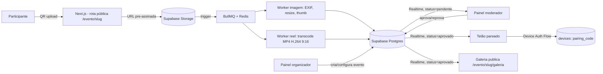

# SPEC — Photofy (Fotos e Reels ao Vivo para Eventos — Clube Condor)

**Estado:** Draft v0.1 — deriva de `00-prd.md`, incorpora decisões já firmadas em ADR-001 e ADR-003

## 1. Decisão de arquitetura

Confirma-se a arquitetura já decidida nos ADRs: aplicação **Next.js** (rotas públicas por slug de evento, sem login para participante) com **Supabase** como backend principal (Postgres + Storage + Auth + Realtime), um **worker BullMQ + Redis** para processamento assíncrono de mídia, e deploy **self-hosted via Docker Swarm + Traefik**, seguindo o mesmo padrão de outros serviços do AI Squad (Hipermais, VideoFlow).

**Alternativas consideradas e por que foram descartadas:**
- **Keycloak/SSO compartilhado** para autenticação de moderadores/admin — descartado porque o produto é isolado, sem necessidade de SSO com o Hipermais; Supabase Auth (magic link/OAuth) evita a complexidade de um realm adicional.
- **Código de pareamento único compartilhado entre todas as telas** (desenho do ADR-002) — descartado no ADR-003 em favor de um código temporário por tela (Device Authorization Flow), permitindo múltiplas telas e revogação individual.
- **Expurgo automático da galeria por dias** (desenho do ADR-002) — descartado no ADR-003; a galeria passa a ser permanente por padrão, com exclusão apenas via `deletion_request` formal, alinhado ao direito de exclusão da LGPD sob demanda do titular em vez de política de retenção fixa.
- **Pré-moderação por IA (Gemini Flash) no fluxo de v1** — presente no ADR-001, mas adiada para v2 no ADR-003; v1 usa moderação 100% humana.



## 2. Stack técnico

| Camada | Escolha | Alternativas consideradas |
|---|---|---|
| Frontend/rotas públicas | Next.js | — (padrão já validado no AI Squad) |
| Auth (moderador/admin) | Supabase Auth (magic link/OAuth) | Keycloak/SSO compartilhado — descartado (isolamento, sem necessidade de realm extra) |
| Banco de dados | Supabase Postgres | — |
| Storage de mídia | Supabase Storage (bucket privado) | — |
| Realtime | Supabase Realtime | Polling puro — mantido como fallback do Spike 3 |
| Fila de processamento | BullMQ + Redis | — (mesmo padrão do VideoFlow) |
| Transcodificação de reel | ffmpeg (worker dedicado) | — |
| Deploy | Docker Swarm + Traefik | — (mesmo padrão do Hipermais/VideoFlow) |
| Segredos | Secrets manager (a definir qual, mesmo padrão dos demais serviços) | Variáveis de ambiente em texto puro — descartado por política de segurança |

## 3. Modelo de dados

```sql
-- events: um evento de marca do Condor; múltiplos podem estar ativos ao mesmo tempo
create table events (
  id uuid primary key default gen_random_uuid(),
  slug text unique not null,
  nome text not null,
  data_inicio timestamptz not null,
  data_fim timestamptz,
  status text not null default 'ativo', -- ativo | encerrado
  timezone text not null default 'America/Sao_Paulo',
  moderacao_on boolean not null default true,
  formatos_aceitos text[] not null default '{jpg,png,heic,mp4}',
  max_foto_mb int not null default 25,
  max_reel_mb int not null default 75,
  max_reel_seg int not null default 10,
  termos_url text,
  background_url text,
  created_at timestamptz not null default now()
);

-- slideshow_config: parametros configuraveis por evento
create table slideshow_config (
  event_id uuid primary key references events(id) on delete cascade,
  seg_por_slide int not null default 6,       -- 3 a 30
  ordem text not null default 'recentes',      -- cronologica | recentes | aleatoria
  transicao text not null default 'fade',      -- fade | slide | nenhuma
  exibir_autor_mensagem boolean not null default true,
  incluir_reels boolean not null default true,
  duracao_reel_telao text not null default 'completo', -- completo | limitado
  loop boolean not null default true,
  escurecimento_bg int not null default 30 -- 0 a 80 (%)
);

-- media_items: fotos e reels enviados
create table media_items (
  id uuid primary key default gen_random_uuid(),
  event_id uuid not null references events(id) on delete cascade,
  tipo text not null,                    -- foto | reel
  autor text,                            -- 0-50 chars, opcional
  mensagem text,                         -- 0-200 chars, opcional
  status text not null default 'pendente', -- pendente | aprovado | reprovado | erro
  url_original text not null,
  url_processada text,
  url_thumb text,
  exif_removido boolean not null default false,
  criado_em timestamptz not null default now()
);
create index on media_items (event_id, status);

-- moderation_log: auditoria de decisoes de moderacao
create table moderation_log (
  id uuid primary key default gen_random_uuid(),
  media_id uuid not null references media_items(id) on delete cascade,
  moderador_id uuid not null references auth.users(id),
  acao text not null,                    -- aprovar | reprovar | reverter
  motivo text,
  timestamp timestamptz not null default now()
);

-- consent_record: prova de consentimento (LGPD)
create table consent_record (
  id uuid primary key default gen_random_uuid(),
  media_id uuid not null references media_items(id) on delete cascade,
  aceite_termos boolean not null,
  aceite_conteudo boolean not null,      -- responsabilizacao por conteudo improprio
  ip_hash text not null,
  user_agent text,
  versao_termos text not null,
  timestamp timestamptz not null default now()
);

-- deletion_request: solicitacao formal de exclusao de um item da galeria permanente
create table deletion_request (
  id uuid primary key default gen_random_uuid(),
  media_id uuid not null references media_items(id) on delete cascade,
  solicitante text not null,
  motivo text,
  status text not null default 'pendente', -- pendente | executada | negada
  timestamp timestamptz not null default now()
);

-- devices: telas pareadas por evento (Device Authorization Flow)
create table devices (
  id uuid primary key default gen_random_uuid(),
  pairing_code text unique not null,
  event_id uuid references events(id) on delete cascade,
  status text not null default 'aguardando', -- aguardando | pareado | revogado | expirado
  paired_at timestamptz,
  last_seen_at timestamptz
);
```

RLS: `media_items`, `moderation_log`, `consent_record`, `deletion_request` e `devices` restritos por `event_id` — nenhuma role acessa dados de um evento que não seja o seu, exceto admin/organizador (role em `profiles`).

## 4. Contratos de API

| Método | Rota | Descrição |
|---|---|---|
| `POST` | `/api/eventos/:slug/upload` | Recebe metadata do upload (tipo, autor, mensagem, aceite) e retorna URL pré-assinada do Storage |
| `POST` | `/api/eventos/:slug/upload/confirmar` | Confirma que o arquivo foi enviado ao Storage; enfileira job de processamento |
| `GET` | `/api/eventos/:slug/galeria` | Lista paginada de `media_items` com `status = aprovado` |
| `GET` | `/api/moderacao/:slug/fila` | Lista `media_items` do evento com filtro por status (autenticado, role moderador) |
| `POST` | `/api/moderacao/:slug/itens/:id/decisao` | Aplica `aprovar` \| `reprovar` \| `reverter`; grava em `moderation_log` |
| `POST` | `/api/moderacao/:slug/itens/decisao-lote` | Aplica a mesma decisão a uma lista de IDs |
| `POST` | `/api/dispositivos/pareamento` | Gera `pairing_code` temporário (expira 10 min) para uma nova tela |
| `POST` | `/api/dispositivos/:pairing_code/vincular` | Admin vincula o código a um `event_id`; tela recebe token somente leitura |
| `POST` | `/api/dispositivos/:id/revogar` | Revoga o token de uma tela pareada sem afetar as demais |
| `POST` | `/api/eventos` | Cria evento (organizador); gera automaticamente slug, links e recursos de pareamento |
| `PATCH` | `/api/eventos/:slug/slideshow-config` | Atualiza parâmetros do slideshow |
| `POST` | `/api/solicitacoes-exclusao` | Participante/titular solicita exclusão de um item específico |
| `PATCH` | `/api/solicitacoes-exclusao/:id` | Organizador executa ou nega a solicitação, com auditoria |

## 5. Cenários de aceitação (Gherkin)

```gherkin
Feature: Upload de foto ou reel pelo participante

  Scenario: Envio de foto válida com aceite marcado
    Given um evento ativo com slug "lancamento-verao"
    And o participante escaneou o QR code do evento
    When o participante seleciona uma foto de 8MB, preenche autor "Ana" e mensagem "Muito bom!"
    And marca o aceite de termos e de conteúdo impróprio
    And confirma o envio
    Then o sistema retorna confirmação de recebimento em até 5 segundos
    And um novo registro é criado em media_items com status "pendente"
    And um registro correspondente é criado em consent_record com aceite_termos=true e aceite_conteudo=true

  Scenario: Botão de envio bloqueado sem aceite
    Given um participante selecionou uma foto válida para envio
    When o aceite de termos e conteúdo não está marcado
    Then o botão de envio permanece desabilitado
    And nenhum registro é criado em media_items

  Scenario: Reel dentro do limite é aceito para processamento
    Given um evento com max_reel_mb=75 e max_reel_seg=10
    When o participante envia um reel de 60MB e 9 segundos, vertical 9:16
    Then o upload é aceito e enfileirado para transcodificação
    And o media_item é criado com tipo "reel" e status "pendente"

  Scenario: Reel fora do limite é rejeitado no cliente
    Given um evento com max_reel_seg=10
    When o participante tenta enviar um reel de 14 segundos
    Then o envio é bloqueado antes do upload
    And uma mensagem de erro explica o limite de duração

Feature: Processamento assíncrono de mídia

  Scenario: Foto processada gera thumbnail e remove EXIF
    Given um media_item do tipo "foto" com status "pendente" na fila
    When o worker de imagem processa o item
    Then url_thumb e url_processada são preenchidos
    And exif_removido é definido como true
    And o item permanece com status "pendente" até decisão do moderador

  Scenario: Reel é transcodificado para o padrão do telão
    Given um media_item do tipo "reel" com status "pendente", arquivo original de 70MB
    When o worker de reel processa o item
    Then o resultado é um MP4 H.264 vertical ~1080p entre 10 e 12MB
    And a duração do resultado não excede 10 segundos

  Scenario: Falha de processamento não expõe erro ao participante
    Given um media_item cujo processamento falha após as tentativas de retry configuradas
    When o worker esgota as tentativas
    Then o item recebe status "erro", isolado para reprocessamento manual
    And nenhuma notificação é exibida ao participante que enviou o item

Feature: Moderação em tempo real

  Scenario: Moderador aprova um item pendente
    Given um media_item com status "pendente" visível na fila de moderação
    When o moderador autenticado aciona "aprovar"
    Then o status do item muda para "aprovado"
    And um registro é criado em moderation_log com acao="aprovar" e o moderador_id correspondente
    And o item passa a aparecer na galeria e na rotação do telão em até 3 segundos

  Scenario: Moderador reprova um item com motivo
    Given um media_item com status "pendente"
    When o moderador aciona "reprovar" com motivo "conteúdo impróprio"
    Then o status do item muda para "reprovado"
    And o item nunca aparece na galeria nem no telão
    And nenhuma comunicação é enviada ao participante sobre essa decisão

  Scenario: Reversão de decisão
    Given um media_item com status "aprovado"
    When o moderador aciona "reverter"
    Then o status do item volta para "pendente"
    And o item some imediatamente da galeria e do telão

  Scenario: Aprovação em lote
    Given 30 media_items com status "pendente" selecionados pelo moderador
    When o moderador aciona "aprovar" em lote
    Then todos os 30 itens mudam para status "aprovado"
    And 30 registros são criados em moderation_log

Feature: Slideshow no telão com pareamento de dispositivo

  Scenario: Tela solicita pareamento e aguarda vínculo
    Given uma tela nova acessando a URL do telão sem token
    When a tela solicita um código de pareamento
    Then um pairing_code é gerado com expiração de 10 minutos
    And a tela exibe o código em tela cheia enquanto faz polling

  Scenario: Admin vincula a tela a um evento
    Given um pairing_code válido gerado há menos de 10 minutos
    When o admin insere esse código no painel e o vincula ao evento "lancamento-verao"
    Then o dispositivo recebe um token de leitura escopado por RLS àquele evento
    And o status do device muda para "pareado"

  Scenario: Slideshow exibe apenas conteúdo aprovado, respeitando configuração
    Given um evento com slideshow_config: seg_por_slide=6, ordem="recentes", incluir_reels=true
    And existem 5 media_items com status "aprovado" e 2 com status "pendente"
    When a tela pareada carrega o slideshow
    Then apenas os 5 itens aprovados entram na rotação
    And cada slide permanece visível por 6 segundos antes de avançar

  Scenario: Revogação de uma tela não afeta as demais
    Given duas telas pareadas ao mesmo evento, "entrada" e "salao-principal"
    When o admin revoga o dispositivo "entrada"
    Then o token de "entrada" deixa de ser válido
    And "salao-principal" continua recebendo atualizações via Realtime normalmente

Feature: Galeria permanente e exclusão sob solicitação

  Scenario: Galeria pública lista apenas conteúdo aprovado
    Given um evento com itens aprovados e reprovados
    When um visitante acessa /evento/lancamento-verao/galeria
    Then somente os itens com status "aprovado" são exibidos
    And o contador de itens reflete apenas os aprovados

  Scenario: Exclusão de item ocorre apenas via solicitação formal
    Given um item aprovado publicado na galeria
    When um titular envia uma deletion_request para esse item
    Then a solicitação é registrada com status "pendente"
    And o item permanece visível na galeria até o organizador executar a solicitação

  Scenario: Organizador executa uma solicitação de exclusão
    Given uma deletion_request com status "pendente"
    When o organizador aprova e executa a exclusão
    Then o media_item deixa de aparecer na galeria e no telão
    And a deletion_request muda para status "executada" com registro de auditoria

Feature: Painel do organizador

  Scenario: Criação de evento gera todos os links automaticamente
    Given um organizador autenticado no painel administrativo
    When ele cria um evento com nome "Lançamento Verão" e slug "lancamento-verao"
    Then o sistema gera automaticamente o link de upload com QR, o link de slideshow, o link de monitoramento e o link de galeria
    And os recursos de pareamento de tela ficam disponíveis imediatamente

  Scenario: Múltiplos eventos ativos simultaneamente e isolados
    Given os eventos "lancamento-verao" e "feira-inverno" estão ambos com status "ativo"
    When um media_item é aprovado no evento "lancamento-verao"
    Then esse item não aparece na galeria nem no telão de "feira-inverno"
```

## 6. Não-funcionais

| Categoria | Requisito |
|---|---|
| Desempenho | Absorver picos de upload (ex. momento do brinde) sem degradar moderação, telão ou galeria — ver Spike 2 |
| Tempo real | Aprovação reflete em telão e galeria em segundos — ver Spike 3 |
| Disponibilidade | Alta disponibilidade durante a janela do evento; sem ponto único de falha |
| Escalabilidade | Workers e API escalam horizontalmente; fila absorve rajadas |
| Segurança | TLS em trânsito e repouso, tokens opacos, scan de arquivos, isolamento por evento via RLS |
| Privacidade / LGPD | Consentimento versionado, remoção de EXIF, exclusão sob solicitação (`deletion_request`) |
| Observabilidade | Logs de moderação, métricas de fila, alertas de falha de processamento |
| Resiliência de rede | Retry automático de upload, validação clara em conexões instáveis |

## 7. CLAUDE.md — pontos a incluir

- Convenção de nomenclatura em português para tabelas/campos de domínio (`media_items`, `moderation_log`, etc.) — manter consistência, não traduzir parcialmente.
- Regra dura: **nenhuma comunicação ao participante sobre decisões de moderação**, em nenhum PR — qualquer feature que viole isso deve ser rejeitada no review.
- Regra dura: exclusão de mídia da galeria **somente** via fluxo `deletion_request` — proibido expurgo automático por tempo/policy no v1.
- RLS por `event_id` é obrigatório em qualquer tabela nova que armazene dado de evento — nunca confiar apenas em filtro de API.
- Branches: `feat/`, `fix/`, `chore/`, `spike/` (nunca mergeada); permanentes: `staging`, `main`.
- Todo PR referencia o issue do Multica e marca quais cenários Gherkin deste SPEC cobre.
- Disclosure de IA obrigatório em cada PR (modelo usado, se houve revisão linha a linha).
- Gate de risco: mudanças em `consent_record`, `deletion_request` ou RLS de `devices`/`media_items` são risco alto — exigem 2 aprovações humanas + QA manual em staging (ver `metodologia-resumen.md`).
